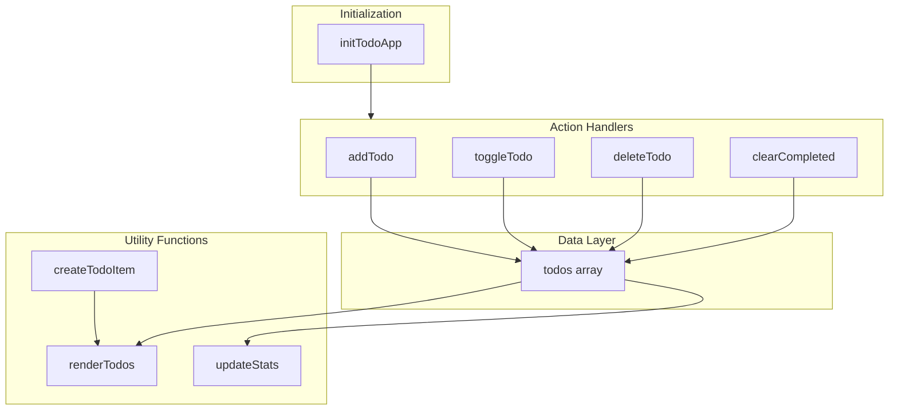

# Kế hoạch phát triển ứng dụng Todo

## Phân tích hiện trạng

- **todo.html**: Giao diện static, có sẵn form, danh sách mẫu và footer, **chưa kết nối JS**
- **todo.js**: File trống, chưa có logic
- **main.js**: Dùng cho index.html khác, không liên quan Todo

**Chức năng cần triển khai:**

1. Thêm todo mới
2. Đánh dấu hoàn thành (toggle checkbox)
3. Xóa từng todo
4. Xóa tất cả todo đã hoàn thành
5. Cập nhật số lượng công việc còn lại

---

## Kiến trúc đề xuất



---

## Cấu trúc module `todo.js`

### 1. State và constants

```javascript
const STORAGE_KEY = "todo-app-data";
let todos = [];
```

- Một mảng `todos` dạng `[{ id, text, completed }]`
- Có thể dùng `localStorage` (qua STORAGE_KEY) để lưu dữ liệu

### 2. DOM References (một lần, dùng lại)

```javascript
const getElements = () => ({
    form: document.getElementById("todoForm"),
    input: document.getElementById("todoInput"),
    list: document.querySelector('ul[aria-label="Danh sách công việc"]'),
    stats: document.querySelector("footer span"),
    clearBtn: document.querySelector("footer button"),
});
```

- Tách phần chọn DOM để dễ sửa selector, dễ test và tối ưu tránh query nhiều lần.

### 3. Utility functions

| Function               | Mô tả                                                                               |
| ---------------------- | ----------------------------------------------------------------------------------- |
| `createTodoItem(todo)` | Nhận object todo, trả về HTML string cho 1 item (checkbox, text, nút xóa)           |
| `renderTodos()`        | Dựa vào `todos`, gọi `createTodoItem` cho từng phần tử, cập nhật innerHTML của list |
| `updateStats()`        | Tính số todo chưa xong và cập nhật nội dung footer                                  |
| `saveToStorage()`      | Lưu `todos` vào localStorage                                                        |
| `loadFromStorage()`    | Đọc từ localStorage và gán lại `todos`                                              |

### 4. Action handlers

| Function           | Mô tả                                                                  |
| ------------------ | ---------------------------------------------------------------------- |
| `addTodo(text)`    | Validate, tạo todo mới, push vào `todos`, render + update stats + save |
| `toggleTodo(id)`   | Tìm todo theo id, đổi `completed`, render + update stats + save        |
| `deleteTodo(id)`   | Lọc bỏ todo theo id, render + update stats + save                      |
| `clearCompleted()` | Lọc bỏ các todo `completed === true`, render + update stats + save     |

### 5. Event handlers

| Function                 | Mô tả                                                                                                               |
| ------------------------ | ------------------------------------------------------------------------------------------------------------------- |
| `handleSubmit(e)`        | `e.preventDefault()`, lấy text từ input, gọi `addTodo(text)`, clear input                                           |
| `handleListClick(e)`     | Dùng event delegation để xử lý click trên list: nếu click checkbox → `toggleTodo`, nếu click nút xóa → `deleteTodo` |
| `handleClearCompleted()` | Gọi `clearCompleted()`                                                                                              |

### 6. Initialization

```javascript
const initTodoApp = () => {
    loadFromStorage();
    renderTodos();
    updateStats();
    bindEvents();
};
```

- `bindEvents()`: Gắn listener cho form, list, footer button.
- Gọi `initTodoApp()` khi DOM ready (`DOMContentLoaded`).

---

## Tối ưu hóa code

1. **Event delegation**: Một listener duy nhất trên `ul` thay vì gắn listener cho từng item.
2. **Tránh query DOM lặp**: Lưu ref trong `getElements()` và dùng lại.
3. **ID unique**: Dùng `Date.now()` hoặc `crypto.randomUUID()` cho mỗi todo.
4. **Render hiệu quả**: Chỉ cập nhật innerHTML khi `todos` thay đổi; không gọi `renderTodos` nhiều lần trong một thao tác nếu không cần.
5. **Validation**: Trim input, chặn chuỗi rỗng trước khi thêm.
6. **localStorage**: `try/catch` khi parse JSON để tránh crash khi dữ liệu lỗi.

---

## Cập nhật `todo.html`

1. Thêm thẻ `<script src="todo.js"></script>` trước `</body>`.
2. Đổi list từ HTML tĩnh sang placeholder rỗng hoặc giữ cấu trúc `ul` với id/attribute rõ ràng để JS dễ target.
3. Đảm bảo các selector trong `getElements()` khớp với HTML.

---

## Thứ tự triển khai

1. Cập nhật `todo.html`: script tag + cấu trúc DOM phù hợp.
2. Viết state, constants và `getElements()`.
3. Viết `createTodoItem`, `renderTodos`, `updateStats`.
4. Viết `addTodo`, `toggleTodo`, `deleteTodo`, `clearCompleted`.
5. Viết `handleSubmit`, `handleListClick`, `handleClearCompleted` và `bindEvents`.
6. Viết `loadFromStorage`, `saveToStorage`.
7. Viết `initTodoApp` và gọi khi DOM ready.
